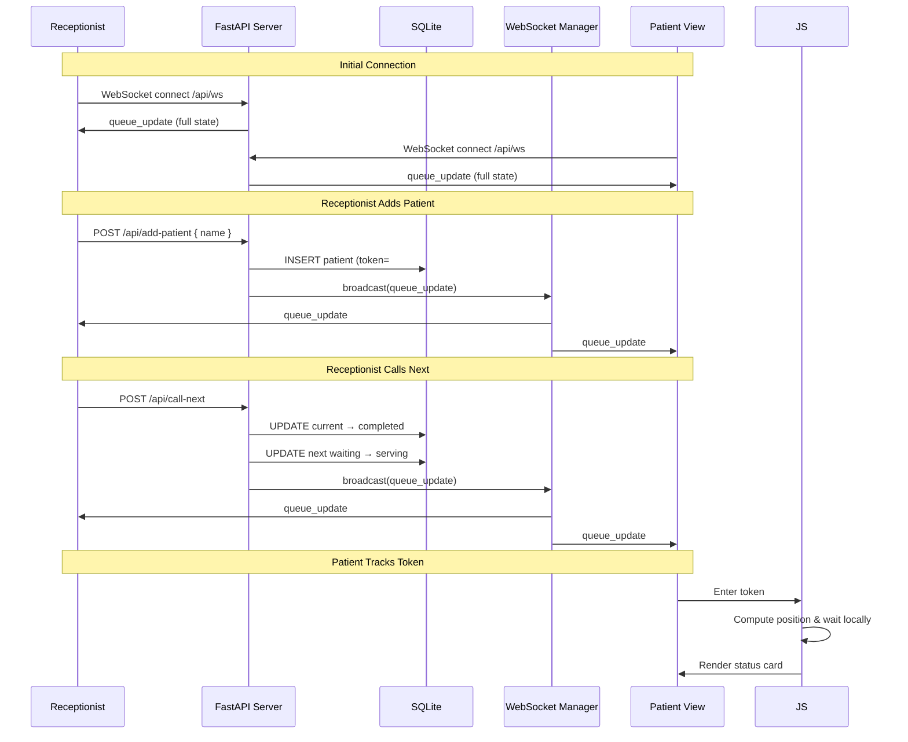

# Queue Cure '26

> Real-Time Clinic Queue Management System

---

## Problem Statement

Outpatient departments in clinics and hospitals suffer from chaotic, paper-based queue management. Patients crowd around reception desks, frequently interrupt to ask "when is my turn?", and staff struggle to maintain order. This leads to:

- Increased patient anxiety due to uncertainty
- Reduced staff efficiency from constant interruptions
- No visibility into current queue status
- No reliable way to estimate wait times

## Why Existing Clinic Queues Fail

| Issue | Impact |
|-------|--------|
| **Paper-based tokens** | Easy to lose, no real-time tracking, manual overhead |
| **No patient visibility** | Patients must physically wait near the counter |
| **First-come-first-serve confusion** | Arguments over order, no audit trail |
| **Static ticket systems** | No estimated wait time, no live updates |
| **No staff dashboard** | Receptionists cannot see the full queue at a glance |

## Solution Overview

Queue Cure '26 is a real-time, WebSocket-powered queue management system designed specifically for clinic reception areas and patient waiting rooms. It provides:

- A **receptionist dashboard** to add patients, call next tokens, and configure consultation times
- A **patient view** to track individual token status and estimated wait time
- **Real-time bidirectional updates** via WebSockets — all connected clients see changes instantly
- **Persistent state** backed by SQLite, surviving server restarts

---

## Features

- **Add Patients** — Receptionist registers a patient; auto-incremented token number assigned
- **Call Next** — One-click transition from waiting → serving → completed
- **Live Queue Display** — Real-time current token, waiting list, and statistics
- **Patient Token Tracking** — Patients enter their token number and see position, tokens ahead, and estimated wait
- **Estimated Wait Time** — Dynamically calculated as `waiting_count × average_consultation_time`
- **Configurable Consultation Time** — Receptionist adjusts average consultation time per clinic workflow
- **WebSocket Broadcast** — All dashboards update in real time when queue state changes
- **RESTful Fallback** — Initial state loaded via REST API before WebSocket connection
- **Auto-Reconnect** — Client automatically reconnects on WebSocket disconnection

---

## Real-Time WebSocket Architecture

```
               ┌─────────────────┐
               │   FastAPI App   │
               │  (Uvicorn ASGI) │
               └────────┬────────┘
                        │
              ┌─────────┴──────────┐
              │  WebSocket Manager │
              │  (Broadcast Hub)   │
              └─────────┬──────────┘
                        │
         ┌──────────────┼──────────────┐
         │              │              │
   ┌─────▼─────┐  ┌────▼─────┐  ┌────▼─────┐
   │Receptionist│  │  Patient │  │  Patient │
   │ Dashboard  │  │   View   │  │   View   │
   │ (Browser)  │  │ (Browser)│  │ (Browser)│
   └────────────┘  └──────────┘  └──────────┘
```

When the receptionist calls the next token or adds a patient, the server:
1. Updates the database
2. Constructs the full queue state
3. Broadcasts a `queue_update` payload to **all** connected WebSocket clients

All clients receive the same state and render it immediately — no polling, no stale data.

---

## Tech Stack

| Layer | Technology | Version |
|-------|-----------|---------|
| **Framework** | FastAPI | 0.115.6 |
| **ASGI Server** | Uvicorn | 0.34.0 |
| **ORM** | SQLAlchemy | 2.0.36 |
| **Database** | SQLite | — |
| **WebSocket** | websockets | 14.1 |
| **Templates** | Jinja2 | 3.1.4 |
| **Frontend** | Vanilla JS, CSS3 | — |

All dependencies are deliberately minimal — no React, no Redis, no external message broker. This keeps the project lightweight and instantly runnable.

---

## Database Schema

```
patients
──────────
id                  INTEGER (PK)
token_number        INTEGER (UNIQUE, INDEXED)
patient_name        VARCHAR
status              VARCHAR  →  "waiting" | "serving" | "completed"
created_at          DATETIME

queue_settings
──────────────
id                  INTEGER (PK)
average_consultation_time  INTEGER (default: 10 minutes)
```

### State Machine

```
[Added]  ──►  "waiting"
                 │
            [Call Next]
                 │
                 ▼
              "serving"
                 │
            [Call Next]
                 │
                 ▼
            "completed"
```

---

## API Endpoints

### REST Endpoints

| Method | Endpoint | Description |
|--------|----------|-------------|
| `GET` | `/receptionist` | Receptionist dashboard page |
| `GET` | `/patient` | Patient tracking page |
| `POST` | `/api/add-patient` | Add a new patient to the queue |
| `GET` | `/api/patients` | List all patients (ordered by token) |
| `POST` | `/api/call-next` | Move current serving → completed, next waiting → serving |
| `GET` | `/api/current-token` | Get the currently serving patient |
| `GET` | `/api/queue-status` | Get current queue state (token, count, wait time) |
| `GET` | `/api/queue-settings` | Get average consultation time |
| `POST` | `/api/queue-settings` | Update average consultation time |

### WebSocket Endpoint

| Protocol | Endpoint | Description |
|----------|----------|-------------|
| `WS` | `/api/ws` | Bidirectional real-time queue updates |

---

## Socket Event Flow Diagram



---

## Project Structure

```
queue-cure-26/
├── app/
│   ├── __init__.py
│   ├── main.py                  # FastAPI app entry point, routes, lifespan
│   ├── database.py              # SQLAlchemy engine, session, Base
│   ├── models.py                # Patient & QueueSettings ORM models
│   ├── schemas.py               # Pydantic request/response schemas
│   ├── websocket_manager.py     # WebSocket connection manager & broadcast
│   ├── routes/
│   │   ├── __init__.py
│   │   └── queue.py             # REST + WebSocket endpoints
│   ├── static/
│   │   ├── script.js            # Frontend logic (WebSocket, DOM updates)
│   │   └── style.css            # Dashboard styling
│   └── templates/
│       ├── patient.html         # Patient tracking page
│       └── receptionist.html    # Receptionist dashboard
├── .gitignore
├── requirements.txt
└── README.md
```

---

## Installation Guide

### Prerequisites

- Python 3.10+
- pip

### Setup

```bash
# 1. Clone the repository
git clone https://github.com/sonaji94/queue-cure-26.git
cd queue-cure-26

# 2. Create virtual environment (recommended)
python -m venv venv

# 3. Activate virtual environment
# Windows:
venv\Scripts\activate
# macOS / Linux:
source venv/bin/activate

# 4. Install dependencies
pip install -r requirements.txt
```

## Running Locally

```bash
uvicorn app.main:app --reload --port 8000
```

Open two browser tabs:

| Page | URL |
|------|-----|
| **Receptionist Dashboard** | http://127.0.0.1:9100/receptionist |
| **Patient View** | http://127.0.0.1:9100/patient |

> The database (`queue_cure.db`) is auto-created on first run.

---

## Screenshots

> *Screenshots will be added after deployment.*  
> The receptionist dashboard features a form to add patients, a live current-token display, a waiting list, queue statistics, and a consultation-time setting. The patient view allows token tracking with real-time position and estimated wait.

---

## Demo Video

> *Demo video link will be added after recording.*  
> The walkthrough will demonstrate: adding patients, calling next token, patient live-tracking their token, and real-time WebSocket updates across multiple browser windows.

---

## Future Improvements

- **JWT-based Authentication** — Role-based access (admin, receptionist, patient)
- **PostgreSQL Migration** — Production-grade database for horizontal scaling
- **Redis Pub/Sub** — Distributed WebSocket broadcast across multiple server instances
- **SMS / Email Notifications** — Notify patients when their turn is near
- **Historical Analytics** — Daily/weekly queue volume, peak hours, average wait trends
- **Multiple Service Counters** — Assign patients to specific doctor rooms or counters
- **Mobile-Optimized PWA** — Progressive Web App for on-the-go patient tracking
- **Docker Containerization** — One-command deployment with docker-compose

---

## Team Information

**Project:** Queue Cure '26  
**Built for:** Hackathon Submission  
**Developer:** Sonaji  
**Repository:** [github.com/sonaji94/queue-cure-26](https://github.com/sonaji94/queue-cure-26)

---

<p align="center">
  <i>Making clinic queues bearable — one real-time token at a time.</i>
</p>
