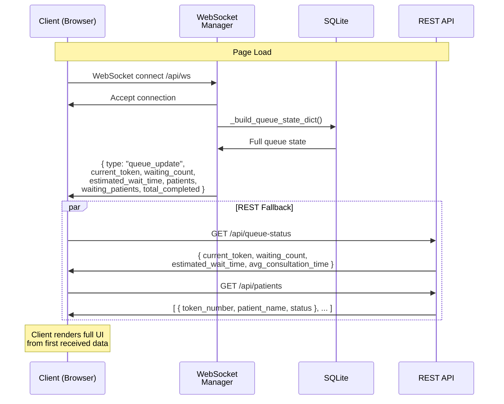
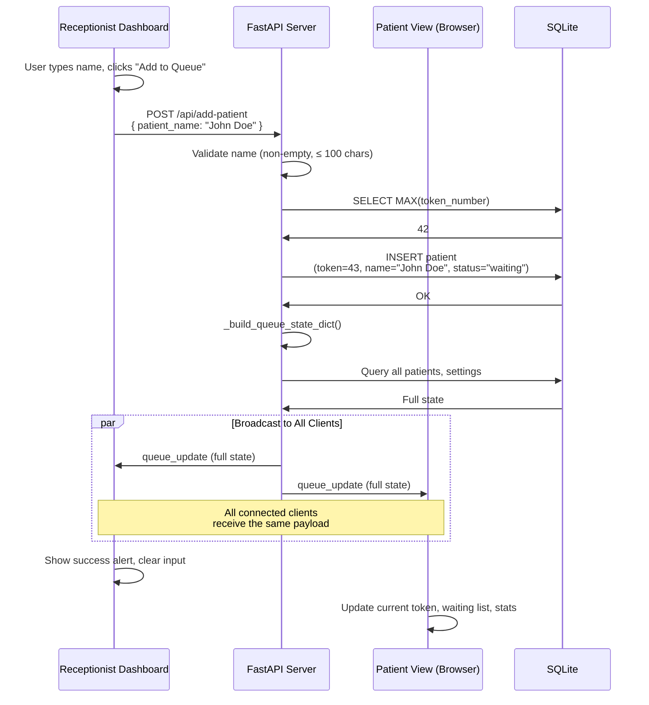
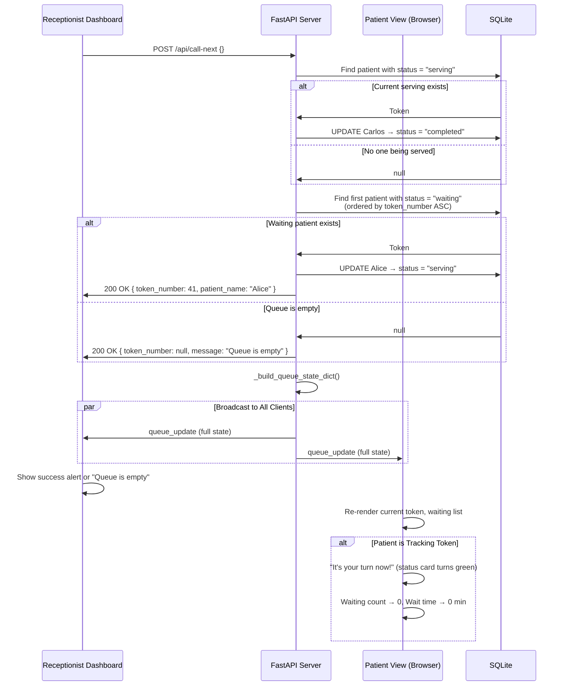
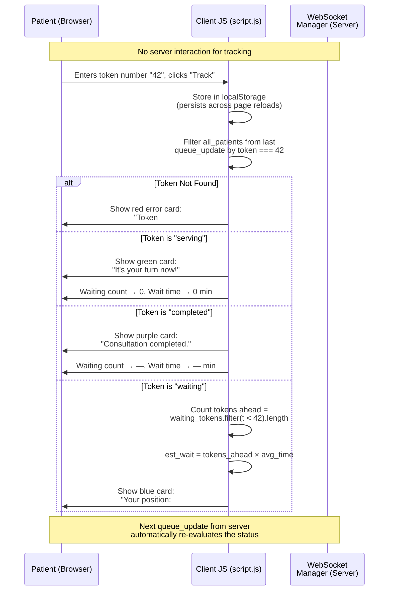
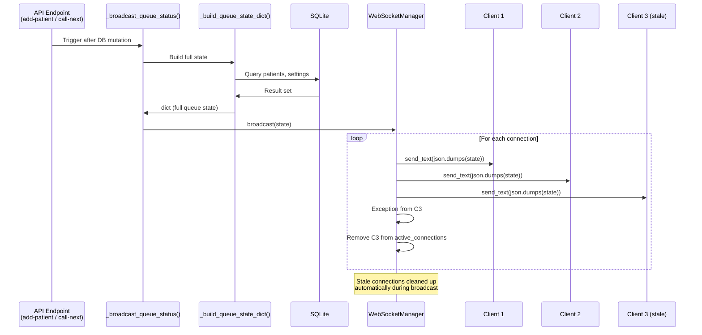
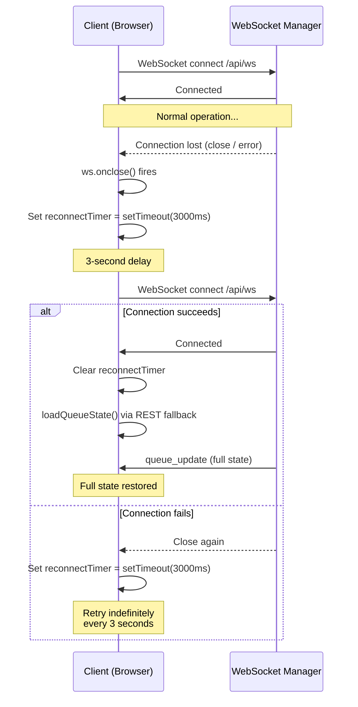

# Socket Event Diagram — Queue Cure '26

> Mermaid sequence diagrams for all WebSocket event flows in the queue management system.

---

## 1. Initial Connection & State Loading

When a client (receptionist or patient) opens a dashboard, two things happen in parallel:

1. **WebSocket connection** to `/api/ws` — establishes persistent channel
2. **REST GET** to `/api/queue-status` + `/api/patients` — fallback initial state



### Key Detail: Race Condition Avoidance

Both the WebSocket message and REST response carry the same `queue_update` payload. The client's `handleQueueUpdate()` is idempotent — calling it twice with the same data is harmless. The first response received renders the UI; the second is a no-op visual update.

---

## 2. Receptionist Flow — Adding a Patient



### Broadcast Payload (Example)

```json
{
  "type": "queue_update",
  "current_token": 40,
  "waiting_count": 4,
  "estimated_wait_time": 40,
  "average_consultation_time": 10,
  "waiting_patients": [
    { "token_number": 41, "patient_name": "Alice", "status": "waiting" },
    { "token_number": 42, "patient_name": "Bob",   "status": "waiting" },
    { "token_number": 43, "patient_name": "John Doe", "status": "waiting" }
  ],
  "patients": [
    { "token_number": 39, "patient_name": "Zara",   "status": "completed" },
    { "token_number": 40, "patient_name": "Carlos", "status": "serving"   },
    { "token_number": 41, "patient_name": "Alice",  "status": "waiting"   },
    { "token_number": 42, "patient_name": "Bob",    "status": "waiting"   },
    { "token_number": 43, "patient_name": "John Doe", "status": "waiting" }
  ],
  "total_completed": 15
}
```

---

## 3. Receptionist Flow — Calling Next Token



### State Transition

```
Before:
┌──────────┬──────────┐
│ Token 40 │ serving  │  ← Carlos being seen
│ Token 41 │ waiting  │  ← Alice next in line
│ Token 42 │ waiting  │
└──────────┴──────────┘

After:
┌──────────┬───────────┐
│ Token 40 │ completed │  ← Carlos done
│ Token 41 │ serving   │  ← Alice called in
│ Token 42 │ waiting   │
└──────────┴───────────┘
```

---

## 4. Patient Flow — Tracking a Token

Patients do **not** send any WebSocket message to track their token. The tracking is handled entirely client-side.



### Local Calculation Logic for Token Position

```
tokens_ahead = all_patients
    .filter(p => p.status === "waiting")
    .map(p => p.token_number)
    .filter(t => t < my_token)
    .length

position = tokens_ahead + 1
est_wait  = tokens_ahead × average_consultation_time
```

---

## 5. WebSocket Broadcast Flow (Internal)



### Stale Connection Cleanup

The `WebSocketManager.broadcast()` method handles disconnections gracefully:

```python
async def broadcast(self, data: dict[str, Any]) -> None:
    message = json.dumps(data)
    stale: list[WebSocket] = []
    for connection in self.active_connections:
        try:
            await connection.send_text(message)
        except Exception:
            stale.append(connection)
    for conn in stale:
        self.disconnect(conn)
```

No separate heartbeat or ping/pong is needed — a disconnected socket raises an exception on `send_text()`, which triggers cleanup.

---

## 6. Auto-Reconnection Flow



---

## Summary of All WebSocket Events

| Direction | Event Type | Trigger | Payload |
|-----------|-----------|---------|---------|
| Server → Client | `queue_update` | Patient added, token called, settings changed | Full queue state (current token, waiting list, stats, all patients) |
| Client → Server | *(none)* | — | Clients are receive-only; all mutations happen via REST |

The WebSocket is used exclusively for **server-to-client broadcast**. All mutations use REST endpoints. This separation of concerns keeps the protocol simple and predictable.
